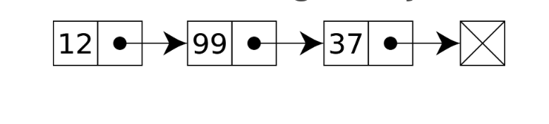
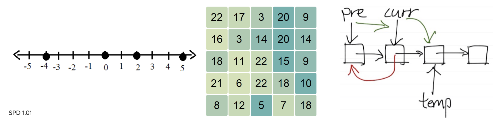

# SPD Class 4 Problem Solving Strategies
[Github Slides Link](https://docs.google.com/presentation/d/10QktdpcIb2veHfELkI_JfE3fWqNwk2laJbmjeknlSPw/edit#slide=id.g4cf79cf4e3_0_202)

## Last class Review

> Doing a quick in class interview

1. Restate the problem
1. Ask clarifying questions
1. State your assumptions
1. Think out loud
  * Brainstorm solutions
  * Explain your rationale
  * Discuss tradeoffs
  * Suggest improvements

### Practice
Original Challenge:

> Find the 5th largest value in an array of *n* numbers.

`Restating the problem`:

> So..You want me to make a function that has one input parameter which is an array of only integers and you want me to return or print the fifth largest item.

`Ask clarifying questions`:
* Is the array in **arbitrary order**?
* Is the output supposed to be printed or returned?
* What would you like me to return if the array is empty?
* What if there's a duplicate of the fifth largest item?
* Do I return a bool if I find?
* What type are the numbers?

`State your assumptions`:
* I'm gonna assume that I don't know how long the array is
* I'm gonna assume that the items are always gonna be integers if it's not empty

`Think Out Loud`:

*Brainstorm solutions*

I was thinking to sort the array and return the fifth item in the list.

*Explain your rationale*

I think this is a very fast and straightfoward way of doing it.

*Discuss tradeoffs*

It's O(n * log n). O(n) would be optimal.

*Suggest improvements*

Try to optimize it's sorting performance.

# Problem solving
> Is just like building an MVP!

You're not expected to find the best possible solution from the beginning. You Just need to just show great thought process.

## Technical Interview Problem Solving Strategy

1. Generate reasonable test inputs
1. Understand the problem – Solve it!
  * Simplify the problem if needed
1. Find a pattern in your solution
1. Make a plan – Write pseudocode
1. Follow your plan – Write real code
1. Check your work – Test your code

### Generate reasonable test inputs

Using test inputs is important because it’s easier to understand a problem and its solution when you **think concretely** with real data **rather than abstractly**.

Sometimes the interviewer may give you an example input or two. If so, great!
– But you should still generate more so you have **at least 2-3 inputs to test**.

Examples of reasonable test inputs:
* List of 4-6 random numbers in a small range:  ```[2, 5, -7, 15, 3]```
* String with 4-6 words in different cases:  "I like coding in Python"
* Linked list with 3-4 nodes with data: 

### Understand the problem – Solve it!

Solve the problem manually to understand it better and generate ideas. <br>

Advantages to solving the problem first by hand (without any code):
* **Create understandable fragments** to plan your pseudocode with
* **Prove your solution could work** (if you follow a methodical process)
* Show the interviewer that **you actually know how to solve the problem**, which may give you some ‘points’, even if you can't finish the code in time

> Don't jump to a solution. Think your way to it out loud.

> If you can’t solve the problem **by hand**, you won’t be able to **tell a computer** how to solve it


Important guidelines to follow while solving the problem manually (by hand):
* Try the **simplest possible approach** – often called “naïve” or “brute-force”
* **Be methodical** – don’t jump around using magic from your human brain
* **Use the whiteboard** – don’t solve it in your head (interviewer can’t see)
* **Use your fingers** to keep track of the current state
  * **Watch what your fingers do** very closely – they will tell you important information about how to implement your solution, like how many **loops**, **indexes**, or **pointers** you need
* Talk through your thoughts as you solve it and **explain what you’re doing at every step** (or need to do if you’re stuck) – ELI5: “Explain Like I’m 5”
* **Write brief** notes on the side as you make realization and discoveries

#### Simplify the Problem if Needed
Sometimes you may be stumped by a challenge problem. If so, **simplify it** and try to solve that. If you can’t, **simplify it even more**. Once you solve a simpler version of the problem, try to expand your solution to solve the complex one.

How to simplify “Find the 5th largest number in an array of *n* numbers”:
* Find the largest number in an array of *n* numbers
* Find the largest number in an array of 3 numbers
* Find the largest number in an array of 2 numbers
* Find the larger number held in 2 integer variables

> Try to do the basic part of the task and build up on it. You'll most likely gonna get hints for the interviewer.

### Find a Pattern in Your Solution
Still stuck? Step back and **consider another way** to understand the problem.

* **Make a visualization** to help you find a pattern
* Numerical problem? Draw a number line and plot some example values
* Two arrays problem? Draw a grid of all possible combinations to check
* Data structure problem? Draw a diagram to show how it’s organized

> Draw a picture or diagram and look for a pattern.



> You should have an idea or lightning struck or insight by now on the challenge.

### Make a Plan – Write Pseudocode
Write out simple pseudocode – the primary goal is to **plan the code structure**

* **Write down every single step** you’re doing in your manual solution
* **Use plain English terms** that make sense to you on the first pass

When you’re done, take a second pass to **refine your pseudocode**

* Consider if there’s another way to perform each task
  * Ex: Looping over an array to search for a value ⇒ Could you use binary search or a set?
* Substitute plain English phrases for specific programming terms to aid you in translating to code later
  * Ex: “Put it in the list” ⇒ “Append it to the list”, “Get smaller number” ⇒ “Call min function”

> See if you've missed something

> This is a good chance to reconsider if this is the way you want to do it.

> This is a great time to explain your rationale.

> Be sure to track the interviewer's reaction. Signs that they're worried or happy. Most people will give it away.

### Follow Your Plan – Write Real Code

Now it’s time to translate your pseudocode into **real code**!

* **Negotiate** which programming language you’ll use before writing code
* “I’d like to write my solution in Python, does that work for you?” ⇒ 80% chance of “Sure!”
* Find a **new area** of the whiteboard, but **don’t erase your pseudocode or test inputs** because you’ll need those to **translate** and **test** your solution
* Start with a **function header**, including input parameters and return value
* **Leave extra space** between lines – you’ll likely need to insert a line later
* **Follow coding conventions** – variable names, casing, indentation rules, …
* When you’re done, take a second pass to **review and revise your code** – no one gets it perfect on the first try

> Propose a language to use! "Is it okay if I use python?" Most people will say yes to Python

> Revise!

### Check Your Work – Test Your Code

Home stretch! It’s finally time to see if you code actually solves the problem.

* **Use a test input** you created before you started solving it by hand
* **Step through your code** to simulate the program actually running
* **Carefully execute each line** exactly as written – ***not*** what you’re thinking
* Write **variable values** in a different color above each line of code, or keep track of them in a chart, or draw arrows on the test input or your diagram
* Remember to evaluate **if**/**while conditions** and after each loop iteration
* Slow down when checking boundary/edge cases (**5 <= 5** vs. **5 < 5**)

> Try to use a different colored marker. It will also make you look very organized!

# Interview Prep with Henry
## 1st Run-through

Interviewer: Timo
Interviewee: Henry  

Challenge:
> Reverse a linkedlist by reusing the nodes. (do not create new nodes)

[x] Restate <br>
[x] Question<br>
[x] Assumptions<br>
[x] Think Out Loud<br>

[x] Test Input<br>
[x] Simplify<br>
[x] Diagram<br>
[] Look for pattern<br>
[] Pseudocode - Jumped into code a little soon.<br>
[X] Negotiate<br>

```Python
def reversed(input):
  """
  input: linkedlist

  Run-time: O(lenght of linkedlist)
  """
  node = input.head
  input.head = input.tail

  for index in range(len(input)):
    input.tail.next = node
    input.tail = node
    node = node.next
```

## 2nd Run-through

Interviewer: Henry
Interviewee: Timo  

Challenge:
> Given an Array and a Target value, return two array items that sum up to be the target item.

[x] Restate<br>
[x] Question<br>
[x] Assumptions<br>
[x] Think Out Loud<br>

[x] Test Input<br>
[x] Simplify<br>
[] Diagram<br>
[x] Look for pattern<br>
[x] Pseudocode - Jumped into code a little soon.<br>
[] Negotiate<br>

```Python
def sum(array, target):
  """
  array: [Int]
  target: Int

  Run-time: O(n^2)
  """

  for item in array:
    new_target = t - item

    if array.contain(new_target) == True:
      return (item, new_target)
  return None
```

# Homework
Watch 2 videos from [Interviewing.io](https://interviewing.io/recordings/) and write down two new things you learned from each video in the course tracker
