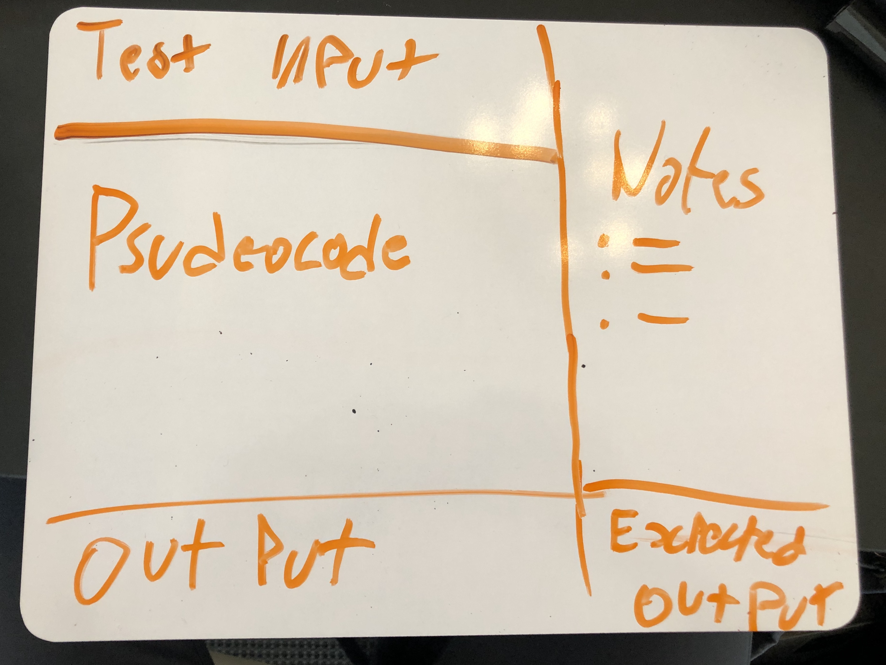
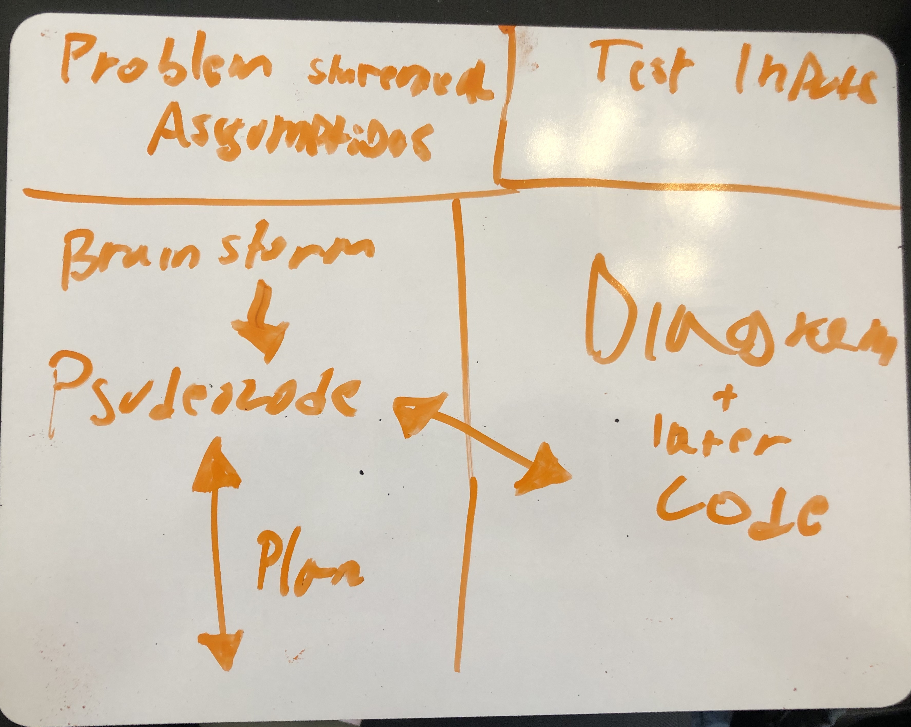
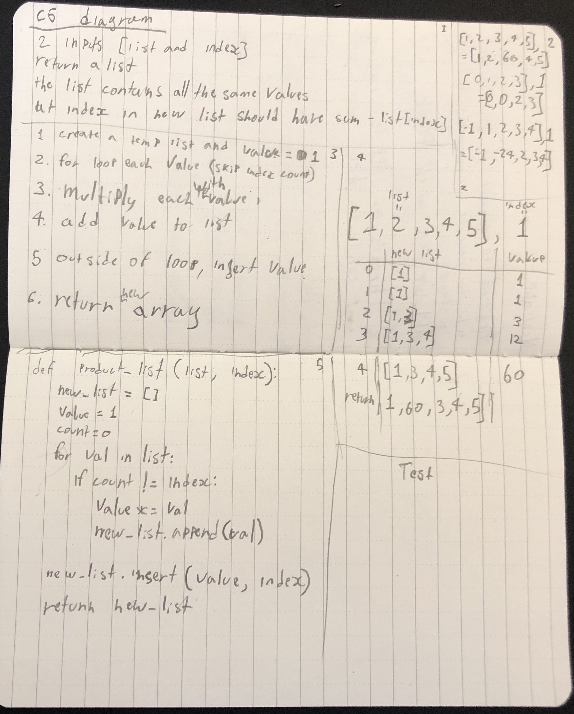

# Whiteboarding

Slides ([link](https://docs.google.com/presentation/d/1Kf6lToDlntg-rlIePyz9torvt4fhlNSfzJuMvUW7DkE/edit#slide=id.g5cdb855d33_0_152))

# Class Activity
Write Down as many different use cases for a whiteboard.
* Try out your solutions / hypothesis as pseudocode.
* Keep track of test input to later also try in your code.
* Keep track of the app's correct outcome and purpose.
* Keep track of output.
* Color code
* Diagram
* Data structure
* Assumptions (connected to the problem)
* Code
* What is the problem
* Test Inputs

Diagram how you would organized your whiteboard.

> Original

> New

Be Flexible and erase an area once you don't need it. (Add things such as helper functions)

# Practice

> Problem 1

