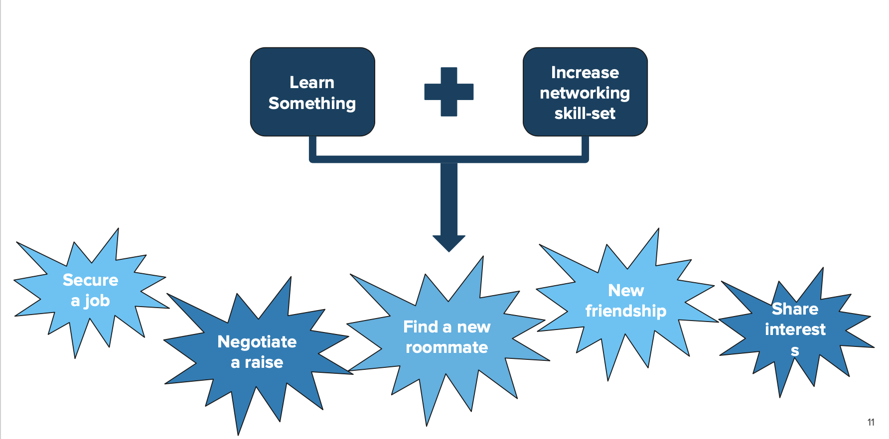

# SPD 1.01 Class 1 Introduction
[Github Link](https://docs.google.com/presentation/d/1DtgX3AjIbCiD1lsjMncHWv-9dI63oVCXJyNNYh1lOIA/edit#slide=id.g4cf79cf4e3_0_202)

# The importance of industry contacts
> It's not just what `you` can get out of it, it's also about what you can `provide to them`.

# What can you get out of it?
* If you meet with recruiters you can aim to get recruited.
* You can just learn something from them.

### How to learn something?
Ask about
* Day to day responsibilities
* Enjoyable things about their job
* Challenges

### How to get recruited?
Talk about
* Skill set needed
* What they look for in candidates
* What you could do to improve, given your current experience.

### When learning about their career path
1. Ask about their `first` job.
2. Things they `wish they had known` earlier.
3. `Advice` for someone new in the same path.

# Fears and Misconceptions
> I feel like spam. 
> I feel like I don't have much to offer. 
> Unknown expectations.  
> Too shy. 
> I don't have time.

* You have plenty of `close connections`.
* Even `here at Make School`.
* You can ask `Jeff`!
* You can go to `events and meetups` (Environments that make it easy to talk to new people).
* Everyone has `at least 20 minutes` to write up an email.
* You can always `create scenarios in your head` and be mildly prepared for the conversation.
* Don't send many email if they haven't answered yet.
* Don't try to hard, `be yourself.`

> If you have fear of not being good enough, be a person willing to learn and improve yourself. -Henry

> You don't really know if you're the person they're looking for, but they don't know it either yet. -Henry

# Tips
1. Remember Henry said above.
2. Use email templates and try to show some personality in them.
3. Let them talk.
4. Confidence is key, market yourself and don't be shy about it.
5. Be more like Timo
6. Do research before reaching out.
7. Think about the situation from their prospective

# Resources
[Jeff's Link](https://docs.google.com/document/d/1q_6pEY0gOCzvK8junqE80KoNe4JzRWoKfS-4I86po4E/edit)
[Job Board Make School Students](https://www.makeschool.com/job-board)

.
